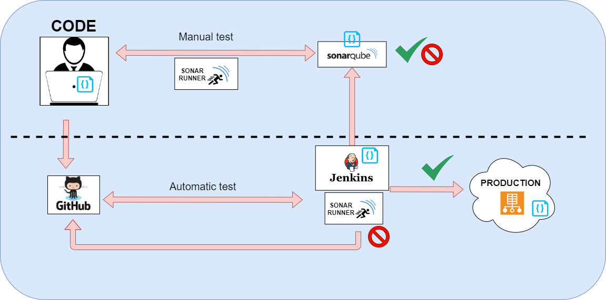

## Objective to perform manual configuration of a project with Sonarqube

In this video we will see the concept of Sonarqube and how to manually configure a project with the Flask web source code.

## Components to see

-  Sonarqube server
-  Sonar scanner
-  Code of basic aplication web Flask


### Sonarqube

SonarQube is an open source platform for static analysis of code quality.




- https://www.sonarqube.org/
- https://github.com/SonarSource/docker-sonarqube

- Versions: 
    - Community
    - Develop
    - Enterprise
    - Data Center

#### advantages of using sonar

- Duplicate code
- Dead code
- Coding standards
- Bugs
- Cyclomatic complexity
- Comments
- Unit and integration tests
- Code coverage (Coverage)

#### Example Cyclomatic complexity:

The result obtained in the calculation of cyclomatic complexity defines the number of independent paths within a code fragment and determines the upper bound of the number of tests that must be performed to ensure that each sentence is executed at least once.

The resulting measure can be used in development, maintenance and reengineering to estimate risk, cost and stability. Some experimental studies indicate the existence of different relationships between the McCabe metric and the number of errors in the source code, as well as the time required to find and correct those errors.
Risk

Once the cyclomatic complexity of a code snippet has been calculated, the risk involved can be determined using the ranges defined in the following table:

Cyclomatic Complexity Risk Assessment

1-10           Simple Program, without much risk
11-20          More complex, moderate risk
21-50          Complex, High Risk Program
50             Program not testable, Very high risk

#### Coverage :

You can monitor the coverage of our tests, so that we check if it is good enough for our quality standards.

#### Rules 


### Create and deploy personality version

```
cd docker
docker build -t "sonar-ideasextraordinarias:v2" .   ( en localhost)

<!-- 
docker  tag  sonar-ideasextraordinarias:v2  aguexitoso/sonar-ideasextraordinarias:v1  ( para subir a registro publico ) 
docker login 
docker push aguexitoso/sonar-ideasextraordinarias:v2 
-->

docker run -d --name sonarqube -p 9000:9000 -p 5432:5432 sonar-ideasextraordinarias:v2

```

Log in to http://localhost:9000 with System Administrator credentials (login=admin, password=admin).


### Sonarscanner


https://docs.sonarqube.org/latest/analysis/scan/sonarscanner/

Sonar Scanner : The SonarScanner is the scanner to use when there is no specific scanner for your build system.
Once the SonarQube platform has been installed, you're ready to install a scanner and begin creating projects. To do that, you must install and configure the scanner that is most appropriate for your needs. Do you build with

Scanners
SonarScanner for Gradle
SonarScanner for MSBuild
SonarScanner for Maven
SonarScanner for Azure DevOps
SonarScanner for Jenkins
SonarScanner for Ant
SonarScanner


### Deploy test with Sonarqube only 


Steps

- New Project and define name
- Create token, and we will define name token, after copy token in secure zone   
  ```
  example : 
  frontend-app1-token: e860a7ae57d17125df16570b489a200308a0eaf8
  backend-app1:        618ddbeabd4f2a9d1c5d4bf37f1ec145a4b1d019
  ```


- Define technology:
    - "Java"
    - "C# or VB.NET"
    - "Other (JS, TS, Go, Python, PHP, ...)"
- Define OS 
    - Linux
    - Windows
    - macOS
- Download and unzip the Scanner for Linux
- Create a configuration file in your project's root directory called sonar-project.properties
  
```
# must be unique in a given SonarQube instance
sonar.projectKey=my:project

# --- optional properties ---

# defaults to project key
#sonar.projectName=My project
# defaults to 'not provided'
#sonar.projectVersion=1.0
 
# Path is relative to the sonar-project.properties file. Defaults to .
#sonar.sources=.
 
# Encoding of the source code. Default is default system encoding
#sonar.sourceEncoding=UTF-8
```

- Run next commands in project's folder, in ours case is /projects/frontend-app1
   
```
   sonar-scanner \
  -Dsonar.projectKey=frontend-app1 \
  -Dsonar.sources=. \
  -Dsonar.host.url=http://localhost:9000 \
  -Dsonar.login=e860a7ae57d17125df16570b489a200308a0eaf8
```


### Documentation 

- https://www.it-swarm.dev/es/sonarqube/
- https://docs.sonarqube.org/latest/analysis/scan/sonarscanner/
- https://docs.sonarqube.org/latest/analysis/scan/sonarscanner-for-jenkins/
- https://www.it-swarm.dev/es/sonarqube/existen-otras-herramientas-de-gestion-de-calidad-que-no-sean-sonarqube/971093933/