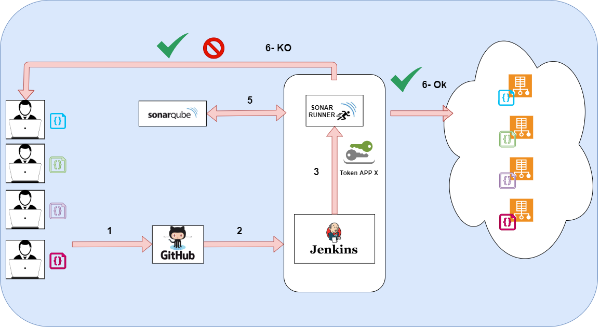

# Sonarqube code testing tool - Configuration for jenkins

## Objective to perform manual configuration of a project with Sonarqube

In this video we will see how to configure Sornarqube in Jenkins and we will test our code by running the pipeline and managing the token safely with credentials



## Components to see

-  Jenkins server  https://github.com/agustinjaume/jenkins-server   ( the best tutorial )
-  Sonarqube server
-  Sonar scanner
-  Code of basic aplication web Flask

###  Sonar Plugin for Jenkins

- https://docs.sonarqube.org/latest/analysis/scan/sonarscanner-for-jenkins/

- Open Jenkins server and we go  to configuration in Jenkins --> Manage Jenkins --> Manage Plugins --> find " SonarQube Scanner for Jenkins" and install.
- After reboot Jenkins we go to Jenkins --> Manage Jenkins --> Global Tool Configuration --> we go to Sonar block.
- 
###  Sonar Plugin for Jenkins

- https://docs.sonarqube.org/latest/analysis/scan/sonarscanner-for-jenkins/

- Open Jenkins server and we go  to configuration in Jenkins --> Manage Jenkins --> Manage Plugins --> find " SonarQube Scanner for Jenkins" and install.
  
  
- 
- After reboot Jenkins we go to Jenkins --> Manage Jenkins --> Global Tool Configuration --> we go to Sonar block.

  

- Go to configuration in Jenkins --> Manage Jenkins --> System configuration --> we go to Sonar block. 


-----------------------

Log in to http://localhost:9000 with System Administrator credentials (login=admin, password=admin).


### Sonarscanner


https://docs.sonarqube.org/latest/analysis/scan/sonarscanner/

Sonar Scanner : The SonarScanner is the scanner to use when there is no specific scanner for your build system.
Once the SonarQube platform has been installed, you're ready to install a scanner and begin creating projects. To do that, you must install and configure the scanner that is most appropriate for your needs. Do you build with

Scanners
SonarScanner for Gradle
SonarScanner for MSBuild
SonarScanner for Maven
SonarScanner for Azure DevOps
SonarScanner for Jenkins
SonarScanner for Ant
SonarScanner

#### Rules 


### Deploy test with Sonarqube only 


Steps

1. New Project and define name
2. Create token, and we will define name token, after copy token in "Credentials Jenkins"
3. Create file properties and save them in the project root folder
4. Run pipeline Jenkins with variable credentials

```
pipeline {
    agent any
    options {disableConcurrentBuilds()}
    environment {
        SCANNER_HOME = tool 'sonarqubescanner'
    }
    stages{
        
        stage('clean workspaces -----------') { 
            steps {
              cleanWs()
              sh 'env'
            } //steps
        }  //stage

        
        stage("git clone -----------------"){
            steps {
                cleanWs()
                    withCredentials([string(credentialsId: 'sonar-token-app1', variable: 'TOKEN')]) {  sh """  echo $TOKEN  """  }
                    checkout([$class: 'GitSCM', 
                    branches: [[name: '*/master']], 
                    doGenerateSubmoduleConfigurations: false, 
                    extensions: [[$class: 'CleanCheckout']], 
                    submoduleCfg: [], 
                    userRemoteConfigs: [
                        [url: 'git@github.com:agustinjaume/sonar.git', credentialsId: '']
                        ]])
                sh 'pwd' 
                sh 'ls -l'
            } //steps
        }  //stage
    
        stage('Code Quality Check via SonarQube') {
            steps {
                script {
                    withSonarQubeEnv("serversonardocker") {
                        sh '''
                        cd projects/frontend-app1
                        pwd
                        $SCANNER_HOME/bin/sonar-scanner \
                        -Dsonar.projectKey=frontend-app1 \
                        -Dsonar.sources=. \
                        -Dsonar.host.url=http://172.17.0.3:9000 \
                        -Dsonar.login=$TOKEN
                        '''
                    } // withSonarQubeEnv
                }
            } //steps
        }  //stage       
   }  // stages
} //pipeline

```